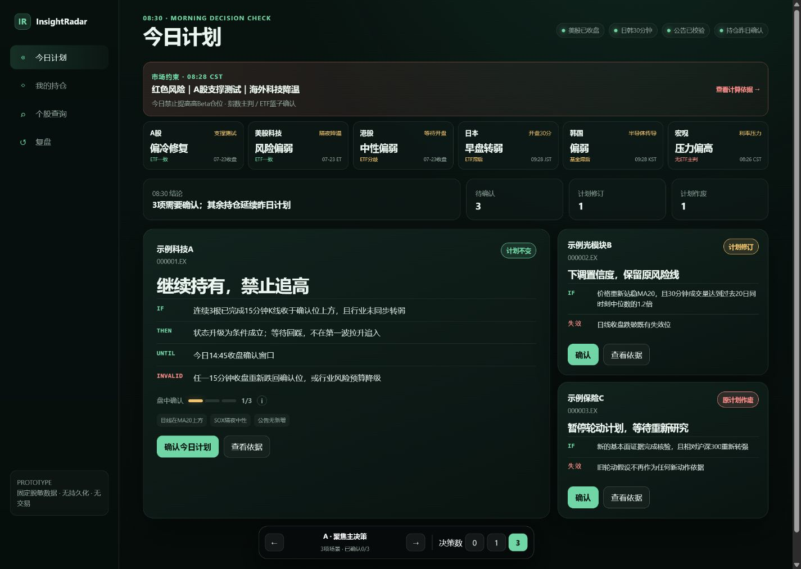
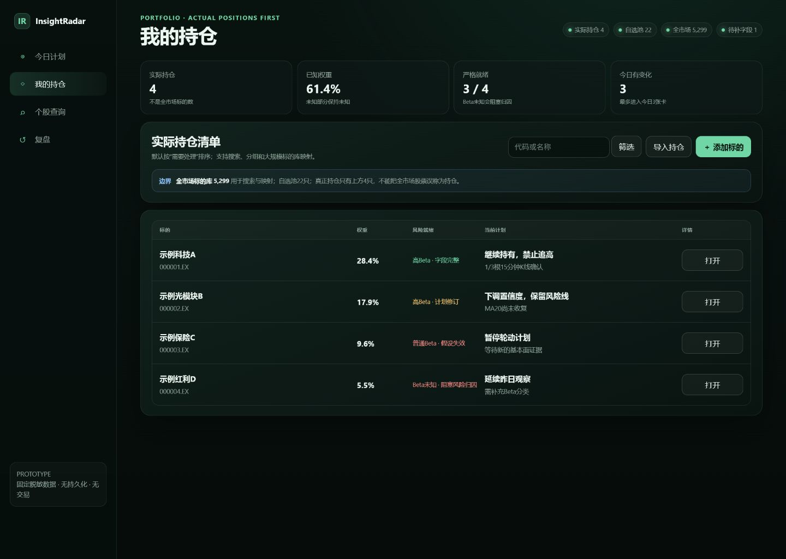
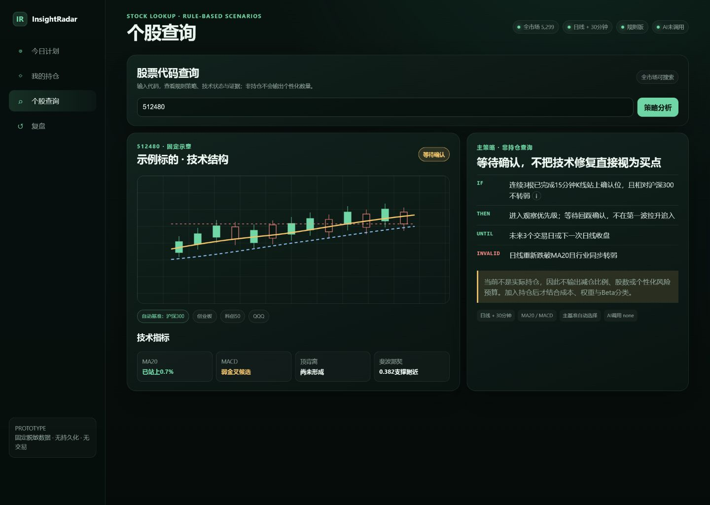
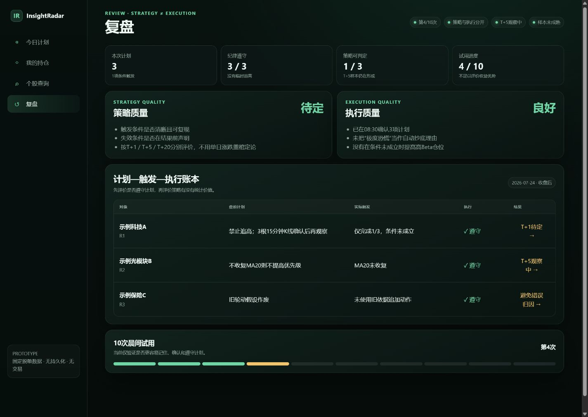

# InsightRadar 08:30 决策闭环原型审计

审计日期：2026-07-24
画布：桌面端 1440 × 1024
范围：今日计划、我的持仓、个股查询、复盘
限制：本次仅审计固定脱敏原型；未覆盖键盘、读屏、真实数据、加载/失败/空状态。

## 总结

当前原型已经不是“功能库存页”，而是一个明确的任务型产品：先确认今日动作，再按需进入持仓、查询和复盘。最值得保留的是克制的深绿视觉、规则优先、策略与证据分层。下一轮不需要重做品牌，而应集中解决“信息竞争”和“四页像四个仪表盘”的问题。

## 1. 今日计划

优点：

- 主决策卡尺寸、位置和按钮优先级清楚，能表达“最多三项确认”。
- 市场约束先于个股动作，且 IF / THEN / UNTIL / INVALID 可解释。
- 市场温度兼顾直接指数与 ETF 交叉确认，没有把单一情绪值包装成确定结论。

风险：

- 市场约束、六个温度块、四个统计块连续堆叠，首张决策卡被压到第二屏视觉层级。
- 六个市场块权重相近，重要性和置信度不易扫读；“宏观”与国家市场并列也容易造成类别混杂。
- 底部原型切换器会抢占主流程注意力，正式版应移出产品 UI。

建议：

- 将六市场温度压缩为一条“总约束 + 2 个主要驱动”，其余进入抽屉。
- 把“3 项需要确认”提升为页面第一视觉锚点，温度只服务于这三项动作。
- 用“数据新鲜度/置信度”而不是更多颜色表达判断可靠性。

## 2. 我的持仓

优点：

- 明确区分实际持仓、自选池和全市场，产品边界表达正确。
- 未知权重、Beta 未知没有被伪装成 0，符合风险产品应有的保守性。
- 表格列基本围绕“现在该做什么”，不是传统行情清单。

风险：

- 四张顶部指标卡占用较多空间，但真正需要处理的三项没有形成行动队列。
- 搜索、筛选、导入、添加都处于同一层级，日常高频动作和低频维护动作竞争。
- 风险状态主要依靠绿/黄/红文字，色觉异常用户的辨识度不足。

建议：

- 默认先展示“今天需要处理 3 项”，完整持仓退到第二层。
- 导入与添加收进“管理持仓”，把搜索/筛选保留在主工具栏。
- 为风险状态增加文本标签或图形语义，不只依赖颜色。

## 3. 个股查询

优点：

- 图表与规则策略并排，符合“证据支持策略”而非“指标替代策略”。
- 非持仓免责声明明确，避免输出伪精确仓位建议。
- “站上”的说明可追溯，技术术语不再是黑箱。

风险：

- 图表和主策略权重接近，用户容易先读指标再读策略；这与“策略更重要”的产品原则略有冲突。
- 技术指标四等分卡片会鼓励逐项看灯，缺少“哪些指标真正参与当前规则”的区分。
- 基准切换、技术指标和规则时间周期的信息密度较高，新用户需要更明显的阅读顺序。

建议：

- 主策略放在第一阅读位，图表作为证据区；参与当前规则的指标高亮，其余折叠。
- 将“为何选择沪深300”做成可悬停提示，并把比较基准与技术周期分组。
- 补充数据缺口和更新时间，让“AI 未调用”旁边也能解释为什么无需调用。

## 4. 复盘

优点：

- 策略质量与执行质量分开，是最有产品辨识度的设计之一。
- 先评价是否遵守计划，再评价策略统计价值，避免结果偏见。
- T+1 / T+5 / T+20 和 10 次试用明确了样本尚未成熟。

风险：

- 页面仍是“指标卡 + 双卡 + 表格”的仪表盘结构，缺少从计划到执行再到结论的时间叙事。
- “3/3 遵守”与“1/3 可判定”容易被误读成策略表现好，样本成熟度需要更显著。
- 账本列较宽，长规则在较小屏幕下可读性和横向滚动风险较高。

建议：

- 以单次决策时间线作为主体，顶部只保留一个“当前能得出的结论”。
- 将策略质量标为“不可判定/证据不足”，避免绿色氛围造成正向暗示。
- 先展示异常与违纪记录；没有异常时再折叠展示完整账本。

## 跨页面优先级

1. 统一四页的核心问题：每页只突出一个“现在需要回答的问题”。
2. 将维护功能、完整证据和低优先级市场温度移入抽屉或次级页。
3. 建立统一的状态语义：行动状态、数据新鲜度、证据置信度、样本成熟度。
4. 保留现有深绿视觉与规则骨架，不做无目的品牌换肤。
5. 下一步先选择一种信息架构方向，再进入 Figma；避免在 Figma 里同时讨论产品结构与像素样式。
