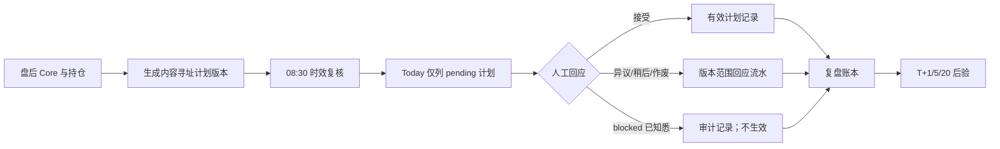

# 核心用户流程

## 主闭环

## 状态不变量

`今日必须处理数量 = active_plans 中 actionable 且 user_response_status == pending 的数量`

当前 actionable 状态为 `new / revised / voided / blocked`。用户回应后，页面重新读取本地流水并从队列中移除已处理项。

## blocked 流程

1. 数据或执行许可不足，计划状态为 `blocked`；
2. 页面不渲染“采纳为今日计划”；
3. API 根据服务器当前计划状态再次校验，不相信客户端状态；
4. 用户可确认已知悉、异议、稍后或作废旧计划；
5. 知悉记录不产生有效计划，也不进入盘中监控；
6. 数据恢复并生成新计划版本后，才可能出现采纳入口。

## 版本展示

- 无上一版：`首次生成`；
- 版本号或规则内容真实变化：显示上一版到今日版；
- 版本号相同且规则相同：只显示执行状态变化，例如 `计划内容未变，执行状态变为 blocked`。

## 冻结期流程

真实使用 → 记录事实 → 仅修复 P0 允许缺陷 → 普通建议进入观察清单 → 完成 10 次后集中复盘 → 决定是否进入 V3.1。
