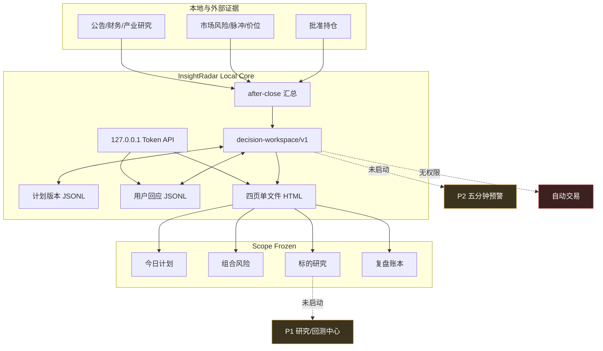

# 系统架构

```mermaid
flowchart TB
    subgraph Inputs["本地与外部证据"]
        P["批准持仓"]
        M["市场风险/脉冲/价位"]
        R["公告/财务/产业研究"]
    end

    subgraph Core["InsightRadar Local Core"]
        AC["after-close 汇总"]
        DW["decision-workspace/v1"]
        PL["计划版本 JSONL"]
        RL["用户回应 JSONL"]
        UI["四页单文件 HTML"]
        API["127.0.0.1 Token API"]
    end

    P --> AC
    M --> AC
    R --> AC
    AC --> DW
    DW <--> PL
    DW <--> RL
    DW --> UI
    API --> RL
    API --> UI

    subgraph Frozen["Scope Frozen"]
        T["今日计划"]
        PF["组合风险"]
        L["标的研究"]
        RV["复盘账本"]
    end

    UI --> T
    UI --> PF
    UI --> L
    UI --> RV

    P1["P1 研究/回测中心"]:::deferred
    P2["P2 五分钟预警"]:::deferred
    AUTO["自动交易"]:::forbidden

    L -. 未启动 .-> P1
    DW -. 未启动 .-> P2
    DW -. 无权限 .-> AUTO

    classDef deferred fill:#3b331d,stroke:#dda84c,color:#fff;
    classDef forbidden fill:#3d2020,stroke:#df746e,color:#fff;
```
