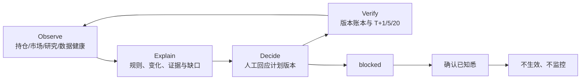

# 决策闭环

```mermaid
flowchart LR
    O["Observe\n持仓/市场/研究/数据健康"] -->
    E["Explain\n规则、变化、证据与缺口"] -->
    D["Decide\n人工回应计划版本"] -->
    V["Verify\n版本账本与 T+1/5/20"]
    V --> O

    B["blocked"] --> K["确认已知悉"]
    K --> X["不生效、不监控"]
    D --> B
```
