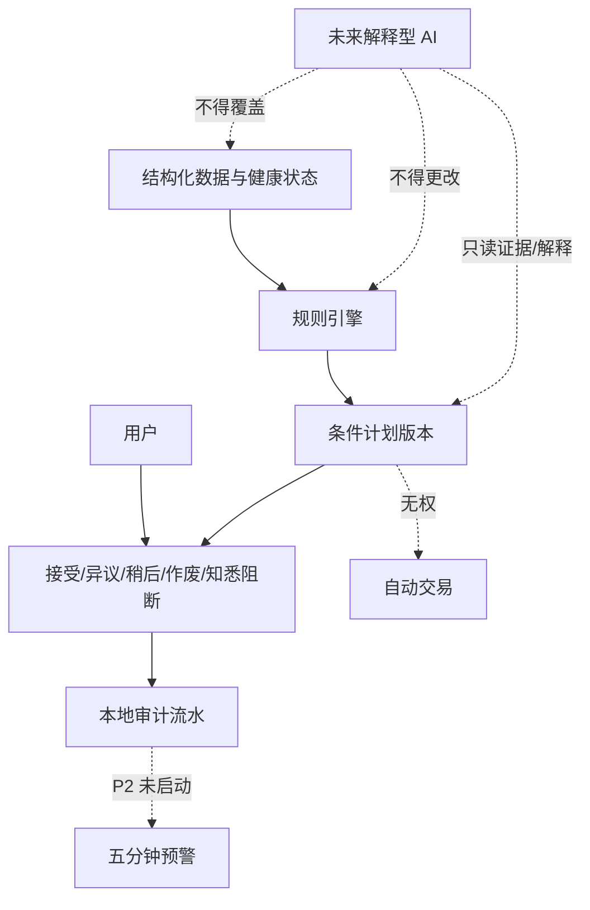

# Agent 执行边界

```mermaid
flowchart TB
    DATA["结构化数据与健康状态"] --> RULE["规则引擎"]
    RULE --> PLAN["条件计划版本"]
    USER["用户"] --> RESPONSE["接受/异议/稍后/作废/知悉阻断"]
    PLAN --> RESPONSE
    RESPONSE --> LEDGER["本地审计流水"]

    AI["未来解释型 AI"] -. 只读证据/解释 .-> PLAN
    AI -. 不得更改 .-> RULE
    AI -. 不得覆盖 .-> DATA

    PLAN -. 无权 .-> TRADE["自动交易"]
    LEDGER -. P2 未启动 .-> ALERT["五分钟预警"]
```
